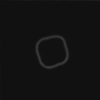

<div align="center">

# Sabi Kit ✦ Project OS
**The Master 28-Stage Product Design Framework & Operational Workbench**

[](https://sabi-ui-kit.vercel.app/)
[](https://react.dev/)
[](https://www.typescriptlang.org/)
[](https://vitejs.dev/)
[](https://tailwindcss.com/)
[](https://greensock.com/)
[](LICENSE)

<br />



<p align="center">
  A master design system, operational workbench, and interactive cognitive laboratory engineered for elite product designers, design engineers, and scaling startups.
</p>

### 🌐 **[Launch Live Application ➔ https://sabi-ui-kit.vercel.app/](https://sabi-ui-kit.vercel.app/)**

[🚀 Live Demo](https://sabi-ui-kit.vercel.app/) • [Explore Framework](#-the-28-stage-product-framework) • [21 Laws of UX](#-21-recognized-laws-of-ux) • [Design Vault (200+)](#-curated-design-vault-200) • [Quick Start](#-quick-start)

</div>

---

## 🌟 Executive Overview

**Sabi Kit** is an architectural end-to-end design system and operational operating system designed to eliminate ambiguity across the entire digital product lifecycle. From discovery and domain landscape modeling to typography systems, auto-layout physics, interactive simulations, and developer QA handoff, Sabi Kit provides a standardized, continuous standard for shipping world-class digital products.

---

## ⚡ Key Highlights & Architecture

### 📐 1. The 28-Stage Product Framework
A continuous, non-linear vertical feed organized into **8 core subdivisions** and **28 distinct stages** with sticky-on-scroll navigation and real-time scroll-spy tracking:

| # | Subdivision | Scope & Covered Stages |
|---|---|---|
| **01** | **Discovery & Intake** | `Stage 01` Cover & Strategy • `Stage 02` Problem Definition • `Stage 03` Master Flow • `Stage 04` Workspace Overview • `Stage 05` Context Brief |
| **02** | **Domain & Landscape** | `Stage 06` Product Understanding • `Stage 07` Domain Landscape Matrix • `Stage 08` Business Model Architecture |
| **03** | **Market & Competitors** | `Stage 09` Competitor Intelligence • `Stage 10` Reference Boards & Moodboards |
| **04** | **User Research & Mapping** | `Stage 11` User Persona Modeling • `Stage 12` Journey Mapping & Sentiment Cycles |
| **05** | **Architecture & Flows** | `Stage 13` Task Flows & Edge States • `Stage 14` Information Architecture Trees |
| **06** | **Wireframing & Screens** | `Stage 15` Screen Inventory & Hierarchy • `Stage 16` Low-Fidelity Wireframes |
| **07** | **Visual Systems & Tokens** | `Stage 17` Visual Direction • `Stage 18` Color System & Contrast • `Stage 19` Typography Scales • `Stage 20` 8pt Spacing Grid |
| **08** | **Engineering & Handoff** | `Stage 21` Component Library • `Stage 22` Design Tokens Matrix • `Stage 23` Fluid Responsive System • `Stage 24` Hi-Fi Screen Pipeline • `Stage 25` QA & Handoff Matrix • `Stage 26` File Hierarchy • `Stage 27` Modularity • `Stage 28` Completion |

---

### 🧠 2. 21 Recognized Laws of UX
A complete cognitive psychology laboratory and heuristic reference system compiling **Jon Yablonski's 21 Laws of UX**, complete with formulas, takeaways, and interactive sandboxes:
- **Heuristic Laws (11)**: *Fitts's Law, Hick's Law, Jakob's Law, Law of Pragnanz, Miller's Law, Occam's Razor, Pareto Principle, Parkinson's Law, Postel's Law, Tesler's Law, Von Restorff Effect.*
- **Gestalt Principles (5)**: *Law of Common Region, Law of Proximity, Law of Similarity, Law of Uniform Connectedness, Law of Closure.*
- **Cognitive & Performance (5)**: *Aesthetic-Usability Effect, Doherty Threshold, Peak-End Rule, Serial Position Effect, Goal-Gradient Effect.*

---

### 💎 3. Curated Design Vault (200+ Resources)
A master directory of essential tools, generative AI prompts, and **94 curated design studios** with live Open Graph meta previews and direct links:
- **Featured Studios**: *Porto Rocha, Mouthwash Studio, Bakken & Bæck, Smith & Diction, WØRKS, Gretel, Koto, Primary, Baggy, Parker Studio, Interbrand, Franklyn, Pentagram, Collins, DesignStudio, Red Antler, Turner Duckworth, 2x4, Play Studio, Base Design*, and more.
- **Rich Meta Previews**: Cards render high-resolution Open Graph image banners and official studio favicons.
- **Comprehensive Categories**: Mobile & Web UI, UX & Cognitive Strategy, Generative AI & Prompts, Typography & Tokens, Motion Frameworks, UI Kits & Code, and 3D Assets.

---

### 🛠️ 4. Operational Designer Workbench
Interactive, live design tools built directly into the operating system:
- **Auto-Layout Studio**: Interactive flexbox and spatial flow generator with live CSS/Tailwind code output.
- **Draggable Canvas**: Infinite pan/zoom interactive spatial board for organizing interface components.
- **Interactive Brief Builder**: Real-time client scope estimator and intake document generator.
- **Design Tokens Matrix**: Semantic token definitions across colors, spacing, elevation, and typography.
- **Web Audio Feedback Engine**: Tactile sound effects for clicks, pops, whooshes, and switches.

---

### 🎬 5. Cinematic Motion & Aesthetics
- **24-Frame 12 FPS Looping Brand Emblem**: Custom sprite-extracted monochrome logo animation running continuously at 12 FPS with zero interpolation blur.
- **High-Definition Landscape Background Video**: Full-bleed cinematic background with adaptive darkening vignettes for optimal text contrast.
- **GSAP Scroll Parallax**: Responsive scroll physics powered by `gsap/ScrollTrigger` and `gsap.matchMedia`.
- **Sticky-on-Scroll Navigation**: Responsive sidebar navigation that smoothly flows inline and sticks to the viewport during vertical scrolling.

---

## 🚀 Quick Start

### Prerequisites
- **Node.js**: `v18.0.0` or higher
- **npm** or **yarn** / **pnpm**

### Installation

```bash
# 1. Clone the repository
git clone https://github.com/Sabishimori/sabi-ui-kit.git

# 2. Navigate to project directory
cd sabi-ui-kit

# 3. Install dependencies
npm install

# 4. Start the local development server (Port 3001)
npm run dev -- --port 3001
```

Open your browser and navigate to **`http://localhost:3001`**.

---

## 🏗️ Production Build

```bash
# Type check and build production bundle
npm run build

# Preview production build locally
npm run preview
```

---

## 📁 Repository Structure

```
sabi-ui-kit/
├── public/
│   ├── assets/
│   │   ├── hero-video.mp4        # High-definition landscape background video
│   │   └── hands-halftone.png    # Editorial halftone texture
│   ├── logo-animated.gif         # 24-frame 12 FPS monochrome looping logo
│   └── logo-frames/              # Individual 200x200 PNG animation frames
├── src/
│   ├── components/
│   │   ├── common/
│   │   │   ├── TopNavbar.tsx     # Floating glassmorphic top navigation bar
│   │   │   ├── AnimatedLogo.tsx  # 12 FPS animated brand logo component
│   │   │   └── Sidebar.tsx       # Sticky-on-scroll workbench navigation
│   │   ├── motion/
│   │   │   ├── StickyRevealFooter.tsx  # Interactive sticky reveal footer
│   │   │   └── GsapKineticText.tsx     # Kinetic typography animations
│   │   ├── pages/
│   │   │   ├── HomePage.tsx      # Landing spread with video hero & telemetry
│   │   │   ├── FrameworkPage.tsx # 28-stage continuous scroll framework
│   │   │   ├── LawsPage.tsx      # 21 Laws of UX laboratory & simulators
│   │   │   ├── ResourcesPage.tsx # 200+ resource vault with live meta cards
│   │   │   └── WorkspacePage.tsx # Interactive designer workbench & tools
│   │   └── sections/
│   │       ├── HeroSection.tsx   # Cinematic video hero section
│   │       ├── LawsOfUXSection.tsx
│   │       └── ... (All 28 framework section modules)
│   ├── data/
│   │   ├── lawsOfUxData.ts       # Complete 21 Laws of UX dataset & formulas
│   │   └── resourcesData.ts      # 200+ design resources & Notion curated studios
│   ├── utils/
│   │   └── audio.ts              # Web Audio API sound feedback engine
│   ├── App.tsx                   # Master router & view switcher
│   ├── main.tsx                  # Application entry point
│   └── index.css                 # Global Tailwind styles & typography
├── .gitignore                    # Production git ignore configuration
├── package.json
├── tailwind.config.js
├── tsconfig.json
└── vite.config.ts
```

---

## 🎨 Design Philosophy & Guidelines

1. **8pt Hard Spatial Grid**: All dimensions, gaps, margins, and line heights align strictly to 4pt and 8pt increments.
2. **Minimalist Editorial Hierarchy**: High-contrast black & white typography (`#111111` & `#FFFFFF`) paired with subtle neutral grays (`#555555`, `#666666`, `#ECEAE6`).
3. **WCAG AAA Compliance**: Minimum 4.5:1 text-to-background contrast ratios across all cards, modals, and navigation labels.
4. **Zero Layout Shift & Fluid Scaling**: Optimized for displays up to 1920px with smooth responsive scaling down to mobile viewports.

---

## 📄 License

Distributed under the **MIT License**. See `LICENSE` for more information.

---

<div align="center">
  <sub>Designed and crafted by <a href="https://github.com/Sabishimori">Sabishimori</a> ✦ Sabi Kit OS V1.0</sub>
</div>
